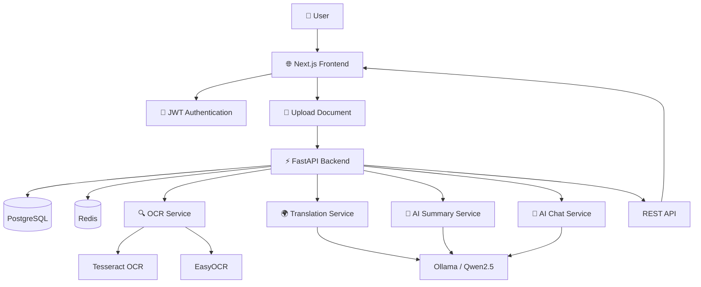
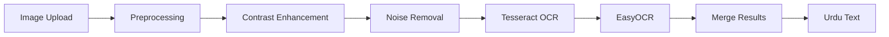
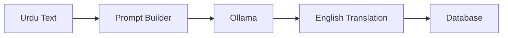
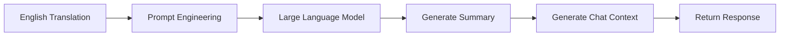

<p align="center">
  
</p>

<h1 align="center">📜 Urdu Document Assistant</h1>

<p align="center">
<b>AI-Powered OCR, Translation, Summarization & Intelligent Document Analysis Platform</b>
</p>

<p align="center">

Transform scanned Urdu documents into searchable, translated, summarized and AI-powered interactive knowledge using OCR, Large Language Models, and modern Full-Stack technologies.

</p>

---

<p align="center">


</p>

<p align="center">


</p>

<p align="center">


</p>

---

# 🎬 Live Demonstration

<p align="center">


</p>

> **Complete AI Workflow**
>
> Upload → OCR → Translation → AI Summary → AI Chat → Document Management

---

# 📖 Project Overview

Urdu Document Assistant is an AI-powered document intelligence platform built for digitizing, preserving, translating, summarizing, and understanding historical Urdu documents.

Unlike traditional OCR applications, this project provides a complete AI workflow capable of extracting Urdu text from scanned documents, translating it into English, generating concise summaries, and allowing users to chat with uploaded documents through Large Language Models.

The platform combines modern OCR techniques with AI to create searchable, interactive, and intelligent digital archives.

---

# ✨ Key Features

## 🔐 Authentication

- JWT Authentication
- Secure Login
- User Registration
- Password Hashing
- Protected Routes
- Session Management

---

## 📄 Document Management

- Upload Documents
- PDF Support
- Image Support
- Delete Documents
- Document History
- Secure Storage

---

## 🔍 OCR Engine

- Urdu OCR
- Tesseract OCR
- EasyOCR
- Image Enhancement
- Noise Reduction
- Contrast Optimization
- Editable OCR Output

---

## 🌍 AI Translation

- Urdu → English
- Context-aware Translation
- Historical Language Support
- AI-generated Output

---

## 🧠 AI Summaries

- Instant Summaries
- Key Points
- Important Entities
- Research Assistance
- Academic Friendly

---

## 💬 AI Chat

Interact naturally with uploaded documents.

Examples:

- What is this document about?
- Summarize this page.
- Translate paragraph 3.
- Explain this section.
- Who are the important people?

---

## 📊 Dashboard

- Upload Statistics
- OCR Status
- Translation Status
- AI Processing Status
- Recent Documents
- User Activity

---

## ⚡ Performance

- FastAPI Backend
- PostgreSQL
- Redis Cache
- Docker Deployment
- Responsive Next.js UI
- Optimized REST APIs

---

# 🌟 Why Urdu Document Assistant?

Historical Urdu documents are difficult to search, understand, and preserve because of poor scan quality, complex ligatures, mixed fonts, and handwritten annotations.

Urdu Document Assistant combines OCR, AI Translation, AI Summaries, and Conversational AI to transform static scanned documents into searchable, understandable, and interactive digital knowledge.

---

# 📚 Table of Contents

- Project Overview
- Features
- Why Urdu Document Assistant
- System Architecture
- Workflow
- Screenshots
- Technology Stack
- Installation
- Docker Deployment
- Environment Variables
- REST API
- Folder Structure
- Roadmap
- Contributing
- License
- Author

---
# 🏗️ System Architecture

Urdu Document Assistant follows a modern full-stack architecture where the frontend communicates with a FastAPI backend through REST APIs. Uploaded documents are processed through an OCR pipeline before being translated, summarized, and made available for AI-powered conversations.



---

# ⚙️ Complete Workflow

```text
Upload Document
        │
        ▼
Validate Image / PDF
        │
        ▼
Image Enhancement
        │
        ▼
OCR Extraction
        │
        ▼
Urdu Text
        │
        ▼
English Translation
        │
        ▼
AI Summary
        │
        ▼
Store Database
        │
        ▼
AI Chat
        │
        ▼
Dashboard
```

---

# 🔍 OCR Processing Pipeline



---

# 🌍 Translation Pipeline



---

# 🧠 AI Processing Pipeline



---

# 📸 Application Screenshots

## 🏠 Home Page

<p align="center">


</p>

---

## 📂 Dashboard

<p align="center">


</p>

---

## 📄 Upload Document

<p align="center">


</p>

---

## 🔍 OCR Result

<p align="center">


</p>

---

## 🌍 Translation

<p align="center">


</p>

---

## 🧠 AI Summary

<p align="center">


</p>

---

## 💬 AI Chat

<p align="center">


</p>

---

## 📊 Dashboard Analytics

<p align="center">


</p>

---

> **Note:** Replace the screenshot filenames above with your actual screenshot filenames.

---

# 🛠️ Technology Stack

| Category | Technologies |
|-----------|--------------|
| Frontend | Next.js 15, React 19, TypeScript, Tailwind CSS |
| Backend | FastAPI, Python 3.12 |
| Authentication | JWT |
| Database | PostgreSQL |
| ORM | SQLAlchemy |
| Migration | Alembic |
| Cache | Redis |
| OCR | Tesseract OCR, EasyOCR |
| AI | Ollama (Qwen2.5) |
| Containerization | Docker & Docker Compose |

---

# 💻 Core Technologies

## 🎨 Frontend

- Next.js 15
- React 19
- TypeScript
- Tailwind CSS
- Axios
- React Hook Form

---

## ⚙️ Backend

- FastAPI
- Python 3.12
- SQLAlchemy
- Alembic
- JWT Authentication
- Pydantic

---

## 🤖 Artificial Intelligence

- Ollama
- Qwen2.5
- AI Translation
- AI Summaries
- AI Chat

---

## 🔍 OCR

- Tesseract OCR
- EasyOCR
- Pillow
- Image Enhancement
- Noise Reduction

---

## ☁️ Infrastructure

- Docker
- Docker Compose
- PostgreSQL
- Redis

---
# 🚀 Quick Start

Follow the steps below to set up the project locally.

---

# 📂 Project Structure

```text
Urdu-Document-Assistant/

├── backend/
│   ├── app/
│   ├── alembic/
│   ├── uploads/
│   ├── requirements.txt
│   ├── Dockerfile
│   └── .env.example
│
├── frontend/
│   ├── app/
│   ├── components/
│   ├── hooks/
│   ├── services/
│   ├── public/
│   ├── package.json
│   ├── Dockerfile
│   └── next.config.ts
│
├── assets/
│   ├── banner/
│   ├── demo/
│   └── screenshots/
│
├── docker-compose.yml
├── README.md
└── LICENSE
```

---

# 💻 Local Installation

## 1️⃣ Clone Repository

```bash
git clone https://github.com/ENAYATULLA/Urdu-Document-Assistant.git

cd Urdu-Document-Assistant
```

---

# ⚙️ Backend Setup

Navigate to backend

```bash
cd backend
```

Create virtual environment

```bash
python -m venv venv
```

Activate

### Windows

```bash
venv\Scripts\activate
```

### Linux / macOS

```bash
source venv/bin/activate
```

Install packages

```bash
pip install -r requirements.txt
```

Run backend

```bash
uvicorn app.main:app --reload
```

Backend

```text
http://localhost:8000
```

Swagger

```text
http://localhost:8000/docs
```

---

# 🌐 Frontend Setup

Navigate

```bash
cd frontend
```

Install packages

```bash
npm install
```

Run

```bash
npm run dev
```

Frontend

```text
http://localhost:3000
```

---

# 🐳 Docker Deployment

Build

```bash
docker compose up --build
```

Run in background

```bash
docker compose up -d
```

Stop

```bash
docker compose down
```

Restart

```bash
docker compose restart
```

View logs

```bash
docker compose logs -f
```

---

# 🌍 Environment Variables

## Backend

Create

```text
backend/.env
```

```env
DATABASE_URL=postgresql://postgres:postgres@db:5432/urdu_assistant

SECRET_KEY=your_secret_key

ALGORITHM=HS256

ACCESS_TOKEN_EXPIRE_MINUTES=60

REDIS_URL=redis://redis:6379

OLLAMA_BASE_URL=http://ollama:11434

OPENAI_API_KEY=your_api_key

UPLOAD_DIR=uploads

MAX_UPLOAD_SIZE=10485760
```

---

## Frontend

Create

```text
frontend/.env.local
```

```env
NEXT_PUBLIC_API_URL=http://localhost:8000
```

---

# 📡 REST API

## Authentication

| Method | Endpoint |
|---------|----------|
| POST | /auth/register |
| POST | /auth/login |
| GET | /auth/me |

---

## Documents

| Method | Endpoint |
|---------|----------|
| POST | /documents/upload |
| GET | /documents |
| GET | /documents/{id} |
| DELETE | /documents/{id} |

---

## OCR

| Method | Endpoint |
|---------|----------|
| POST | /ocr/process |
| GET | /ocr/status/{id} |

---

## Translation

| Method | Endpoint |
|---------|----------|
| POST | /translation |
| GET | /translation/{id} |

---

## Summary

| Method | Endpoint |
|---------|----------|
| POST | /summary |
| GET | /summary/{id} |

---

## AI Chat

| Method | Endpoint |
|---------|----------|
| POST | /chat |
| GET | /chat/history/{document_id} |

---

# 📄 Example Response

```json
{
    "id": 1,
    "filename": "historical-document.jpg",
    "ocr_text": "...",
    "translated_text": "...",
    "summary": "...",
    "status": "completed",
    "created_at": "2026-06-30T12:30:00Z"
}
```

---

# 🔐 Authentication Flow

```text
User Login
      │
      ▼
Verify Credentials
      │
      ▼
Generate JWT
      │
      ▼
Return Token
      │
      ▼
Store Token
      │
      ▼
Authenticated Requests
```

---

# 📦 Docker Services

| Service | Port |
|----------|------|
| Frontend | 3000 |
| Backend | 8000 |
| PostgreSQL | 5432 |
| Redis | 6379 |
| Ollama | 11434 |

---

# ⚡ Performance

- FastAPI Async Backend
- Redis Cache
- PostgreSQL
- Dockerized Deployment
- Optimized OCR Pipeline
- High-speed REST APIs
- Modular Architecture
- Production Ready

---

# 🔒 Security

Current implementation includes

- JWT Authentication
- Password Hashing
- Protected Routes
- Secure File Upload
- Input Validation
- API Validation
- Error Handling

Future improvements

- Refresh Tokens
- OAuth Login
- Rate Limiting
- HTTPS Enforcement
- Audit Logs
- Virus Scanning

---
# 🛣️ Future Roadmap

The project is continuously evolving. Planned improvements include the following milestones.

---

## ✅ Phase 1 (Completed)

- User Authentication
- JWT Security
- OCR Integration
- Urdu → English Translation
- AI Document Summarization
- AI Chat with Documents
- Responsive Dashboard
- Docker Support

---

## 🚧 Phase 2

- Multi-page PDF OCR
- Batch Processing
- Export to PDF
- Export to DOCX
- Advanced Search
- Document Version History
- User Profile Management

---

## 🚀 Phase 3

- Retrieval-Augmented Generation (RAG)
- Semantic Search
- Multi-LLM Support
- OpenAI Integration
- Google Gemini Integration
- DeepSeek Integration
- Claude Integration
- AI Document Classification

---

## 🌍 Phase 4

- Cloud Deployment
- Team Collaboration
- Mobile Application
- Public REST API
- Enterprise Dashboard
- Multi-language Interface

---

# 🧪 Testing

Future testing tools include

- Pytest
- Jest
- React Testing Library
- Playwright
- Postman Collections

---

# 📈 Project Highlights

- Modern Full-Stack Architecture
- FastAPI Backend
- Next.js 15 Frontend
- PostgreSQL Database
- Redis Cache
- Docker Deployment
- JWT Authentication
- OCR Processing
- AI Translation
- AI Summaries
- AI Chat
- Responsive Dashboard
- RESTful APIs
- Modular Architecture
- Production-Ready Codebase

---

# 🤝 Contributing

Contributions are always welcome.

If you'd like to contribute:

## 1. Fork the repository

## 2. Create a feature branch

```bash
git checkout -b feature/amazing-feature
```

## 3. Commit your changes

```bash
git commit -m "Add amazing feature"
```

## 4. Push to your branch

```bash
git push origin feature/amazing-feature
```

## 5. Open a Pull Request

Every contribution, no matter how small, helps improve the project.

---

# 🐞 Reporting Issues

If you discover a bug, please include:

- Operating System
- Python Version
- Node.js Version
- Browser Version
- Error Message
- Steps to Reproduce
- Expected Behaviour

Providing detailed information helps resolve issues more efficiently.

---

# 💡 Project Vision

Urdu Document Assistant aims to become an open-source platform for preserving, digitizing, translating, and understanding historical Urdu documents using Artificial Intelligence.

The long-term goal is to help researchers, historians, libraries, universities, and organizations transform historical archives into searchable and interactive digital knowledge.

---

# 📄 License

This project is licensed under the **MIT License**.

You are free to:

- Use
- Modify
- Distribute
- Fork
- Build upon this project

Please retain the original license when redistributing the project.

---

# 🙏 Acknowledgements

Special thanks to the amazing open-source community and the technologies that made this project possible.

- FastAPI
- Next.js
- React
- PostgreSQL
- Redis
- Docker
- SQLAlchemy
- Alembic
- Tesseract OCR
- EasyOCR
- Ollama
- Qwen2.5

---

# ⭐ Support the Project

If you found this repository useful, please consider:

⭐ Starring the repository

🍴 Forking the repository

📢 Sharing it with others

🐛 Reporting bugs

💻 Contributing new features

Your support motivates future development.

---

# 👨‍💻 Author

<p align="center">

## Enayat Ullah

**Computer Science Engineer**

**Artificial Intelligence • NLP • OCR • Full-Stack Development**

Passionate about building AI-powered software focused on Natural Language Processing, Computer Vision, OCR, and modern Full-Stack Development.

</p>

<p align="center">

<a href="https://github.com/ENAYATULLA">

</a>

<a href="https://www.linkedin.com/in/enayat-ullah-65a6a1252/">

</a>

<a href="mailto:enayatullah9857@gmail.com">

</a>

<a href="https://enayat-ullah-portfolio.vercel.app/">

</a>

</p>

---

<div align="center">

# 🌟 If you like this project, don't forget to leave a Star!

Made with ❤️ by **Enayat Ullah**

</div>