```markdown
<div align="center">

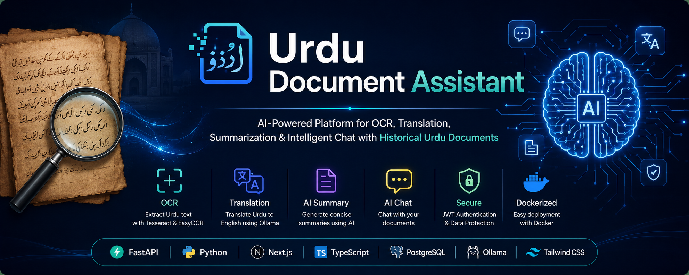

# Urdu Document Assistant

### AI-Powered OCR, Translation & Intelligent Document Analysis Platform for Historical Urdu Documents

<p align="center">

An end-to-end full-stack platform that extracts text from Urdu documents using OCR, translates it into English, generates AI-powered summaries, and enables intelligent conversations with uploaded documents—all through a modern, responsive web interface.

</p>

<p align="center">


</p>

<p align="center">


</p>

<p align="center">


</p>

---

### Live Demonstration

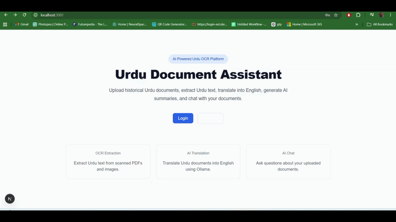

> **Complete AI-powered workflow**
>
> Upload → OCR → Translation → AI Summary → AI Chat → Document Management

---

## Table of Contents

- [Project Overview](#project-overview)
- [Why Urdu Document Assistant](#why-urdu-document-assistant)
- [Key Features](#key-features)
- [Project Workflow](#project-workflow)
- [System Architecture](#system-architecture)
- [Application Screenshots](#application-screenshots)
- [Technology Stack](#technology-stack)
- [Installation](#installation)
- [Docker Deployment](#docker-deployment)
- [Environment Variables](#environment-variables)
- [REST API Overview](#rest-api-overview)
- [Folder Structure](#folder-structure)
- [Authentication Flow](#authentication-flow)
- [OCR Pipeline](#ocr-pipeline)
- [AI Processing Pipeline](#ai-processing-pipeline)
- [Development Guide](#development-guide)
- [Future Roadmap](#future-roadmap)
- [Contributing](#contributing)
- [License](#license)
- [Author](#author)

---

# Project Overview

Urdu Document Assistant is a modern AI-powered document processing platform designed to digitize, preserve, and analyze Urdu-language documents through advanced Optical Character Recognition (OCR), machine translation, and Large Language Models (LLMs).

The platform enables users to upload scanned Urdu documents or images, automatically extract text using OCR engines, translate the extracted content into English, generate concise AI-powered summaries, and interact with documents through a conversational AI interface.

Rather than acting as a simple OCR tool, the application provides a complete intelligent document-processing workflow suitable for:

- Historical document preservation
- Digital humanities research
- Academic institutions
- Libraries and archives
- Researchers
- Students
- Government organizations
- Language learning
- Personal document management

Built with a modern microservice-friendly architecture, the project combines FastAPI, PostgreSQL, Redis, Next.js, TypeScript, Docker, and locally hosted LLMs via Ollama to provide a scalable and privacy-focused AI solution.

---

# Why Urdu Document Assistant

Digitizing historical Urdu documents is a challenging problem because many scanned manuscripts contain:

- Low-quality scans
- Noise
- Skewed pages
- Mixed fonts
- Old printing styles
- Handwritten annotations
- Complex Urdu ligatures

Traditional OCR systems often struggle with these characteristics.

Urdu Document Assistant addresses these challenges by integrating:

- Advanced OCR engines
- AI-assisted translation
- Intelligent summarization
- Conversational document understanding
- Modern full-stack architecture
- Secure authentication
- Responsive user experience

The result is a complete platform that transforms static scanned documents into searchable, understandable, and interactive digital resources.

---

# Key Features

## Authentication & Security

- JWT Authentication
- Secure Login & Registration
- Password Hashing
- Protected Routes
- Token-Based Authorization
- Session Management

---

## Intelligent OCR

- Urdu OCR using Tesseract
- EasyOCR integration
- Automatic image preprocessing
- Noise reduction
- Contrast enhancement
- Improved text recognition
- Editable OCR results

---

## AI Translation

- Urdu → English Translation
- Context-aware translation
- Preservation of document meaning
- High-quality AI-generated output
- Support for historical language structures

---

## AI Summarization

Generate concise summaries of lengthy Urdu documents.

Features include:

- Key point extraction
- Important entities
- Quick document overview
- Research assistance
- Reading time reduction

---

## AI Chat with Documents

Users can communicate directly with uploaded documents.

Example questions:

- What is this document about?
- Summarize page 3.
- Who are the important people mentioned?
- Translate paragraph 5.
- Explain this section.
- What are the major events described?

---

## Document Management

- Upload documents
- Organize files
- View OCR text
- Store translations
- Manage summaries
- Search documents
- Delete documents
- View processing history

---

## Dashboard

A modern analytics dashboard providing:

- Document statistics
- OCR status
- Translation status
- AI processing overview
- User activity
- Recent uploads

---

## Responsive User Interface

Designed using modern UI principles with:

- Mobile-first layout
- Responsive design
- Clean typography
- Smooth navigation
- Fast page transitions
- Accessible components
- Modern dashboard experience

---

## Performance

- FastAPI asynchronous backend
- Redis caching
- PostgreSQL database
- Dockerized services
- Optimized API communication
- Efficient document processing
- Modular architecture
- Scalable deployment

---
```
````markdown
# Project Workflow

The Urdu Document Assistant follows a complete AI-powered document processing pipeline that transforms scanned Urdu documents into searchable, translated, summarized, and interactive knowledge.

```mermaid
flowchart LR

A[Upload Urdu Document] --> B[Image Validation]

B --> C[Image Preprocessing]

C --> D[Tesseract OCR]

D --> E[EasyOCR Enhancement]

E --> F[Extract Urdu Text]

F --> G[Store OCR Result]

G --> H[Urdu → English Translation]

H --> I[Generate AI Summary]

I --> J[Store Summary]

J --> K[AI Chat with Document]

K --> L[Dashboard & Document Management]
````

---

# System Architecture

The platform follows a modern full-stack architecture with separate frontend, backend, database, caching, OCR, and AI processing components.

```mermaid
graph TD

User((User))

User --> Frontend

subgraph Frontend

NextJS[Next.js 15]

React[React 19]

Tailwind[Tailwind CSS]

TypeScript[TypeScript]

Axios[Axios]

end

Frontend --> API

subgraph Backend

API[FastAPI]

JWT[JWT Authentication]

OCR[OCR Service]

Translation[Translation Service]

Summary[Summary Service]

Chat[AI Chat Service]

Document[Document Service]

end

API --> PostgreSQL

API --> Redis

OCR --> Tesseract

OCR --> EasyOCR

Translation --> Ollama

Summary --> Ollama

Chat --> Ollama

subgraph Storage

PostgreSQL[(PostgreSQL)]

Redis[(Redis)]

end

subgraph AI

Ollama[Qwen2.5:3B]

end
```

---

# OCR Processing Pipeline

The OCR engine combines image preprocessing with multiple OCR technologies to maximize recognition accuracy.

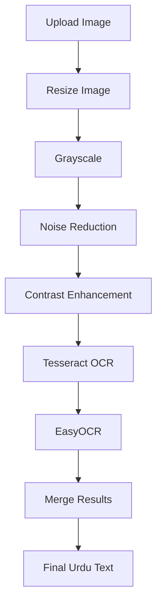

---

# AI Processing Pipeline

Once OCR is complete, the extracted Urdu text flows through multiple AI-powered processing stages.

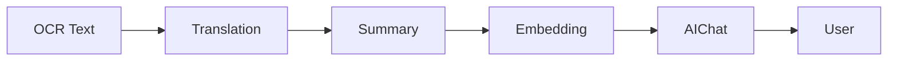

---

# Application Screenshots

## Home Page

<p align="center">

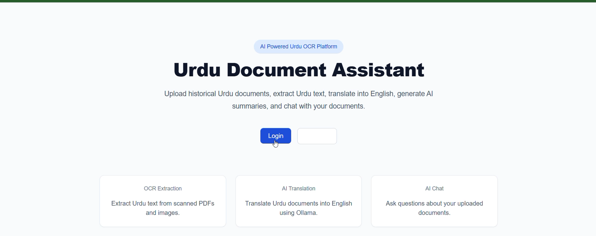

</p>

Modern landing page introducing the platform and its capabilities.

---

## Login

<p align="center">

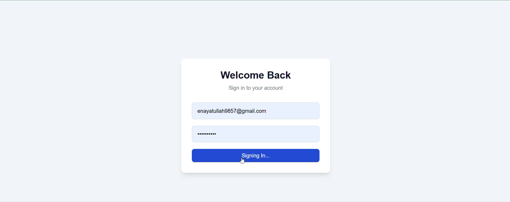

</p>

Secure JWT-based user authentication.

---

## Registration

<p align="center">


</p>

Simple account creation interface.

---

## Dashboard

<p align="center">

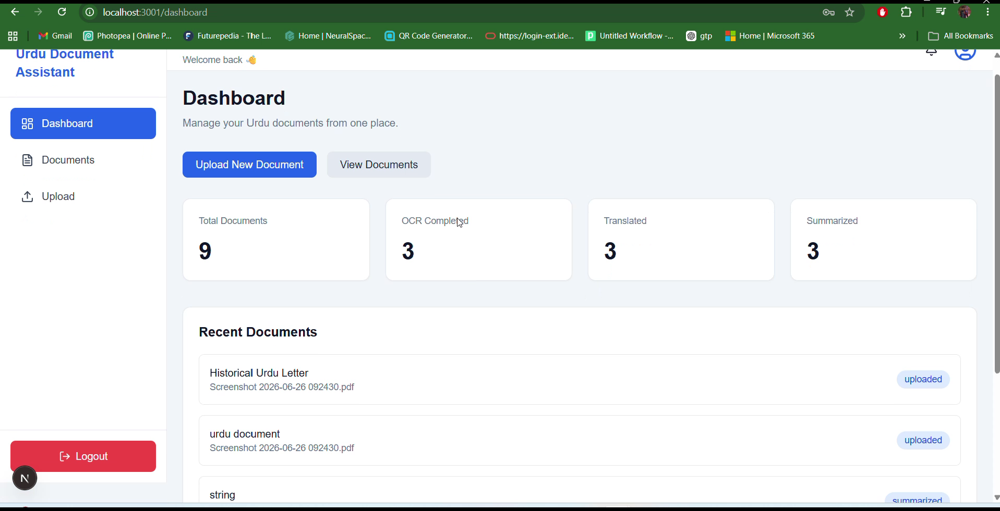

</p>

A centralized dashboard showing document statistics, recent uploads, and processing status.

---

## Upload Document

<p align="center">

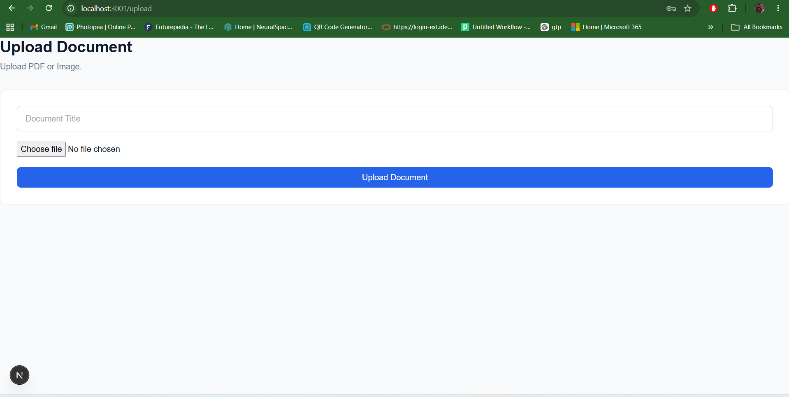

</p>

Upload scanned Urdu documents or images.

---

## Documents

<p align="center">

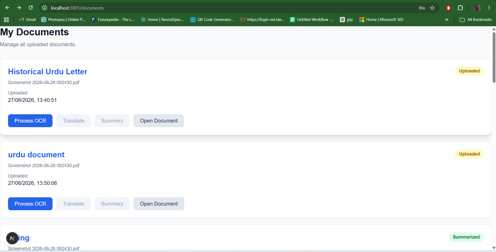

</p>

Manage uploaded documents from a single interface.

---

## Document Details

<p align="center">


</p>

View metadata, OCR results, translations, and AI-generated information.

---

## OCR Results

<p align="center">

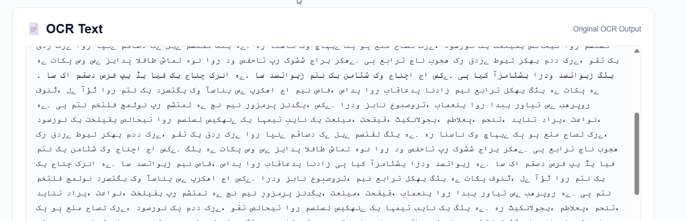

</p>

Extracted Urdu text generated using OCR.

---

## English Translation

<p align="center">

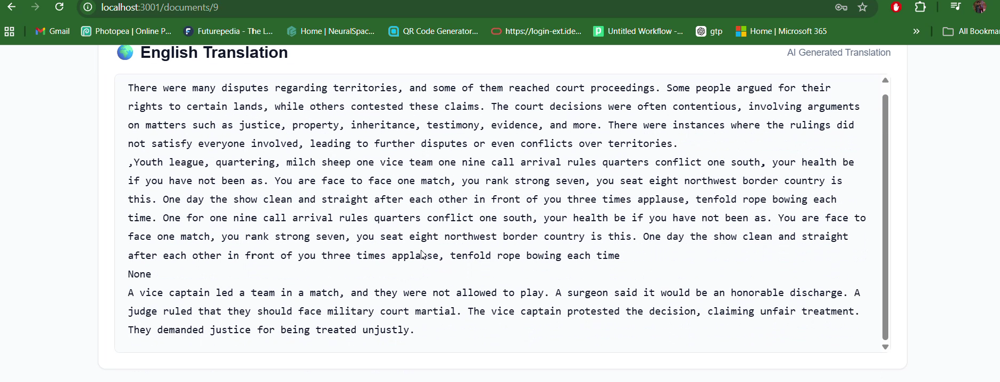

</p>

AI-powered Urdu to English translation.

---

## AI Summary

<p align="center">

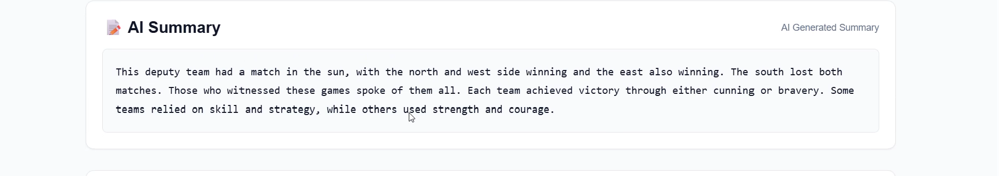

</p>

Automatically generated document summary highlighting the most important information.

---

## AI Chat

<p align="center">

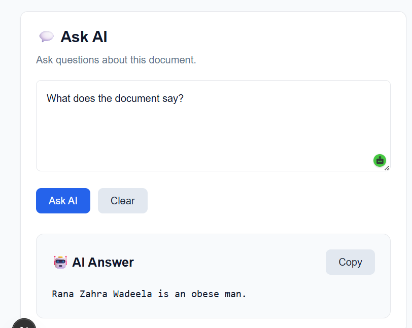

</p>

Interact with uploaded documents using natural language queries.

---

# End-to-End Processing Workflow

The platform transforms raw scanned documents into intelligent digital knowledge through the following stages:

| Stage               | Description                                               |
| ------------------- | --------------------------------------------------------- |
| 📄 Upload           | User uploads an Urdu document or scanned image            |
| 🖼 Image Processing | Image enhancement, resizing, denoising, and preprocessing |
| 🔍 OCR              | Urdu text extraction using Tesseract + EasyOCR            |
| 🌐 Translation      | AI-powered Urdu to English translation                    |
| 🧠 Summary          | Automatic document summarization                          |
| 💬 AI Chat          | Ask natural-language questions about the document         |
| 📂 Storage          | Store OCR text, translations, and summaries               |
| 📊 Dashboard        | Track all uploaded documents and processing history       |

---

# Design Principles

The project has been designed with the following engineering goals:

* Clean Architecture
* Modular Backend
* RESTful APIs
* Scalable Services
* Secure Authentication
* Dockerized Deployment
* AI-First Workflow
* Responsive UI
* Maintainable Codebase
* Production-Ready Structure

---

````markdown
# Technology Stack

The Urdu Document Assistant is built using a modern, scalable, and AI-focused technology stack.

| Category | Technologies |
|-----------|--------------|
| **Frontend** | Next.js 15, React 19, TypeScript, Tailwind CSS, Axios |
| **Backend** | FastAPI, Python 3.12 |
| **Database** | PostgreSQL |
| **ORM** | SQLAlchemy |
| **Database Migration** | Alembic |
| **Authentication** | JWT Authentication |
| **Caching** | Redis |
| **OCR Engine** | Tesseract OCR, EasyOCR |
| **Artificial Intelligence** | Ollama (Qwen2.5:3B) |
| **Containerization** | Docker, Docker Compose |
| **API Communication** | REST API |
| **Development Tools** | Git, VS Code |
| **Package Managers** | pip, npm |

---

# Prerequisites

Before running the project, ensure the following software is installed on your system.

| Software | Version |
|----------|----------|
| Python | 3.12+ |
| Node.js | 20+ |
| npm | Latest |
| PostgreSQL | 16+ |
| Redis | Latest |
| Docker Desktop | Latest |
| Git | Latest |
| Tesseract OCR | Latest |
| Ollama | Latest |

---

# Installation

## 1. Clone the Repository

```bash
git clone https://github.com/ENAYATULLA/Urdu-Document-Assistant.git

cd Urdu-Document-Assistant
```

---

## 2. Project Structure

```
Urdu-Document-Assistant/

├── backend/
├── frontend/
├── docker/
├── assets/
├── README.md
├── docker-compose.yml
└── .env
```

---

# Backend Installation

## Create Virtual Environment

Windows

```bash
python -m venv venv
```

Activate

```bash
venv\Scripts\activate
```

Linux / macOS

```bash
python3 -m venv venv

source venv/bin/activate
```

---

## Install Dependencies

```bash
cd backend

pip install -r requirements.txt
```

---

## Database Migration

```bash
alembic upgrade head
```

---

## Start Backend

```bash
uvicorn app.main:app --reload
```

Backend will be available at

```
http://localhost:8000
```

Swagger Documentation

```
http://localhost:8000/docs
```

ReDoc

```
http://localhost:8000/redoc
```

---

# Frontend Installation

Move to frontend

```bash
cd frontend
```

Install packages

```bash
npm install
```

Start development server

```bash
npm run dev
```

Frontend

```
http://localhost:3000
```

---

# Docker Deployment

The entire application can be launched using Docker Compose.

## Build Containers

```bash
docker compose build
```

---

## Start Services

```bash
docker compose up -d
```

---

## View Running Containers

```bash
docker compose ps
```

---

## View Logs

Backend

```bash
docker compose logs backend
```

Frontend

```bash
docker compose logs frontend
```

Database

```bash
docker compose logs db
```

Redis

```bash
docker compose logs redis
```

---

## Stop Containers

```bash
docker compose down
```

---

## Remove Volumes

```bash
docker compose down -v
```

---

# Environment Variables

## Backend (.env)

```env
DATABASE_URL=postgresql://postgres:password@db:5432/urdu_document_assistant

SECRET_KEY=your_secret_key

ALGORITHM=HS256

ACCESS_TOKEN_EXPIRE_MINUTES=30

REDIS_URL=redis://redis:6379

OPENAI_API_KEY=

OLLAMA_BASE_URL=http://host.docker.internal:11434

OLLAMA_MODEL=qwen2.5:3b

TESSERACT_CMD=/usr/bin/tesseract
```

---

## Frontend (.env.local)

```env
NEXT_PUBLIC_API_URL=http://localhost:8000
```

---

# Running Without Docker

Start PostgreSQL

↓

Start Redis

↓

Run Backend

↓

Run Frontend

↓

Start Ollama

↓

Upload Documents

---

# Running With Docker

```bash
docker compose up --build
```

Everything starts automatically.

- PostgreSQL
- Redis
- FastAPI
- Next.js

Only Ollama needs to be running locally if it is not containerized.

---

# Verify Installation

Open the following URLs:

| Service | URL |
|----------|-----|
| Frontend | http://localhost:3000 |
| Backend | http://localhost:8000 |
| Swagger API | http://localhost:8000/docs |
| ReDoc | http://localhost:8000/redoc |

If all services are accessible, the application has been successfully installed.

---

# Production Build

## Frontend

```bash
npm run build

npm start
```

---

## Backend

```bash
uvicorn app.main:app \
    --host 0.0.0.0 \
    --port 8000
```

---

# Recommended Production Stack

| Component | Recommendation |
|-----------|----------------|
| Reverse Proxy | Nginx |
| SSL | Let's Encrypt |
| Backend | FastAPI + Uvicorn |
| Frontend | Next.js Production Build |
| Database | PostgreSQL |
| Cache | Redis |
| AI Model | Ollama (Qwen2.5:3B) |
| Containerization | Docker Compose |
| OS | Ubuntu Server 24.04 LTS |

---

# Quick Start

```bash
git clone https://github.com/ENAYATULLA/Urdu-Document-Assistant.git

cd Urdu-Document-Assistant

docker compose up --build
```

Open

```
http://localhost:3000
```

Create an account.

Upload a scanned Urdu document.

Extract OCR.

Translate into English.

Generate an AI summary.

Chat with your document.

🚀 You're ready to use the Urdu Document Assistant.

---
````
````markdown
# REST API Overview

The backend exposes a RESTful API built with **FastAPI**. All endpoints return JSON responses and use JWT-based authentication where required.

---

## Authentication

| Method | Endpoint | Description |
|--------|----------|-------------|
| POST | `/api/v1/auth/register` | Register a new user |
| POST | `/api/v1/auth/login` | Login and receive JWT access token |
| GET | `/api/v1/auth/me` | Retrieve the authenticated user's profile |

---

## Documents

| Method | Endpoint | Description |
|--------|----------|-------------|
| POST | `/api/v1/documents/upload` | Upload a new document |
| GET | `/api/v1/documents` | Retrieve all user documents |
| GET | `/api/v1/documents/{id}` | Retrieve a specific document |
| DELETE | `/api/v1/documents/{id}` | Delete a document |

---

## OCR

| Method | Endpoint | Description |
|--------|----------|-------------|
| POST | `/api/v1/documents/{id}/ocr` | Extract Urdu text using OCR |

---

## Translation

| Method | Endpoint | Description |
|--------|----------|-------------|
| POST | `/api/v1/documents/{id}/translate` | Translate Urdu text into English |

---

## AI Summary

| Method | Endpoint | Description |
|--------|----------|-------------|
| POST | `/api/v1/documents/{id}/summary` | Generate an AI-powered summary |

---

## AI Chat

| Method | Endpoint | Description |
|--------|----------|-------------|
| POST | `/api/v1/chat` | Chat with an uploaded document |

---

## Interactive API Documentation

FastAPI automatically generates interactive API documentation.

| Documentation | URL |
|--------------|-----|
| Swagger UI | `http://localhost:8000/docs` |
| ReDoc | `http://localhost:8000/redoc` |

---

# Folder Structure

The project follows a clean and modular architecture.

```text
Urdu-Document-Assistant/
│
├── backend/
│   ├── app/
│   │   ├── api/
│   │   ├── auth/
│   │   ├── core/
│   │   ├── db/
│   │   ├── models/
│   │   ├── schemas/
│   │   ├── services/
│   │   ├── utils/
│   │   └── main.py
│   │
│   ├── alembic/
│   ├── uploads/
│   ├── requirements.txt
│   └── Dockerfile
│
├── frontend/
│   ├── app/
│   ├── components/
│   ├── hooks/
│   ├── services/
│   ├── types/
│   ├── utils/
│   ├── public/
│   ├── package.json
│   └── Dockerfile
│
├── assets/
│   ├── banner/
│   ├── demo/
│   └── screenshots/
│
├── docker-compose.yml
├── README.md
└── .env
```

---

# Authentication Flow

The application secures all protected resources using **JWT Authentication**.

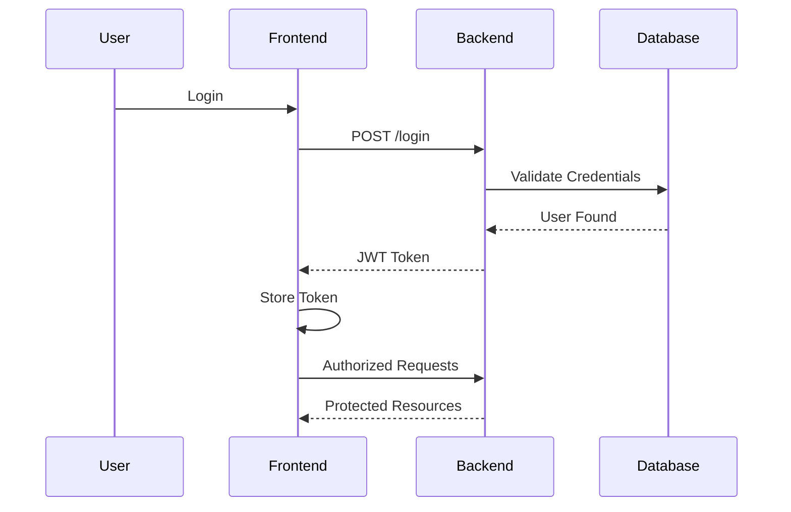

---

# OCR Processing Architecture

The OCR module combines traditional OCR with AI-assisted preprocessing for improved Urdu text extraction.

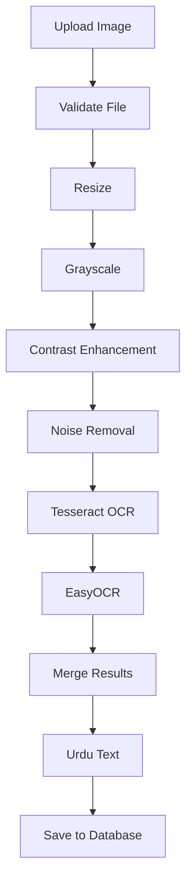

---

# AI Processing Pipeline

After OCR extraction, the text flows through multiple AI services.

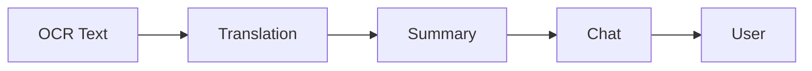

---

# Database Design

The application stores all processed information inside PostgreSQL.

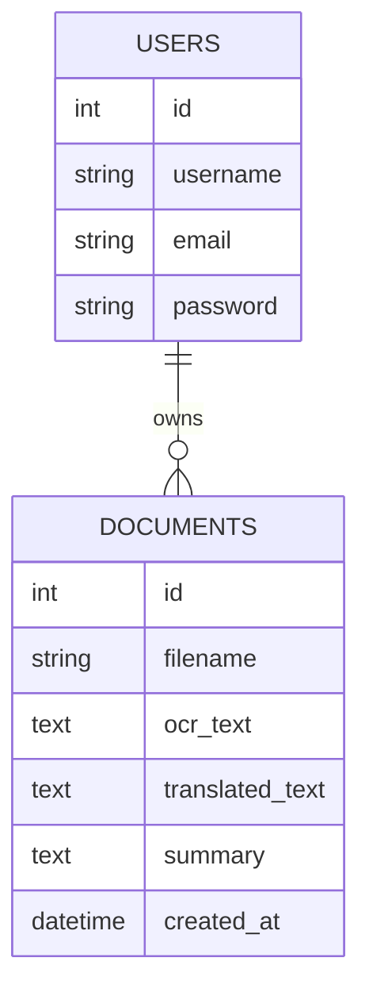

---

# Request Lifecycle

```text
User Upload

↓

FastAPI Validation

↓

Store Original File

↓

OCR Processing

↓

Database Storage

↓

Translation

↓

AI Summary

↓

Chat Ready

↓

Dashboard Display
```

---

# Security Features

The application includes several security mechanisms to protect user data.

- JWT Authentication
- Password Hashing
- Protected API Routes
- Secure File Upload Validation
- Database ORM Protection
- SQL Injection Prevention
- CORS Configuration
- Input Validation with Pydantic
- Environment-based Secrets
- Docker Isolation

---

# Performance Optimizations

To improve scalability and responsiveness, the project includes the following optimizations:

- ⚡ FastAPI asynchronous request handling
- ⚡ SQLAlchemy ORM optimization
- ⚡ Redis caching
- ⚡ Efficient database indexing
- ⚡ Modular service architecture
- ⚡ Lazy frontend rendering
- ⚡ Type-safe API communication
- ⚡ Dockerized deployment
- ⚡ Optimized OCR preprocessing
- ⚡ Local LLM inference using Ollama

---

# Design Philosophy

This project is built around the following engineering principles:

- Clean Code
- Separation of Concerns
- Modular Architecture
- Reusable Components
- Secure by Default
- AI-First Development
- Scalable Infrastructure
- RESTful API Design
- Responsive User Experience
- Production-Ready Deployment

---
````
````markdown
# Development Guide

This section is intended for contributors and developers who want to understand, extend, or maintain the project.

---

## Development Workflow

The recommended workflow for local development is:

```text
Clone Repository
        │
        ▼
Create Virtual Environment
        │
        ▼
Install Backend Dependencies
        │
        ▼
Install Frontend Dependencies
        │
        ▼
Configure Environment Variables
        │
        ▼
Run PostgreSQL & Redis
        │
        ▼
Run FastAPI Backend
        │
        ▼
Run Next.js Frontend
        │
        ▼
Start Ollama
        │
        ▼
Begin Development
```

---

# Local Development

## Backend

Run the FastAPI development server:

```bash
cd backend

uvicorn app.main:app --reload
```

---

## Frontend

```bash
cd frontend

npm run dev
```

---

## Database Migration

Whenever database models are modified:

Create a migration:

```bash
alembic revision --autogenerate -m "Describe your changes"
```

Apply migrations:

```bash
alembic upgrade head
```

Rollback one migration:

```bash
alembic downgrade -1
```

---

# Coding Standards

To maintain a consistent codebase, follow these guidelines.

## Backend

- Follow PEP 8
- Use type hints
- Write modular services
- Keep API routes lightweight
- Validate requests using Pydantic
- Handle exceptions gracefully
- Write reusable utility functions

---

## Frontend

- Use functional React components
- Prefer TypeScript interfaces
- Keep components reusable
- Organize files by feature
- Use Tailwind utility classes
- Avoid duplicated UI logic

---

# Git Workflow

Recommended Git workflow for contributors.

Create a feature branch:

```bash
git checkout -b feature/new-feature
```

Commit changes:

```bash
git commit -m "Add new feature"
```

Push branch:

```bash
git push origin feature/new-feature
```

Create a Pull Request.

---

# Recommended VS Code Extensions

| Extension | Purpose |
|-----------|----------|
| Python | Python development |
| Pylance | IntelliSense |
| FastAPI Snippets | Backend productivity |
| Docker | Container management |
| PostgreSQL | Database explorer |
| Tailwind CSS IntelliSense | CSS autocomplete |
| ESLint | JavaScript linting |
| Prettier | Code formatting |
| GitLens | Git insights |
| Error Lens | Better error visualization |

---

# Testing Strategy

The application should be tested at multiple levels.

## Backend Testing

Recommended:

- Unit Tests
- Integration Tests
- API Tests

Tools:

- pytest
- httpx
- FastAPI TestClient

Example:

```bash
pytest
```

---

## Frontend Testing

Recommended tools:

- Jest
- React Testing Library

Example:

```bash
npm test
```

---

# Deployment

The project is designed to be deployed using Docker Compose.

Production deployment typically consists of:

```text
Internet
      │
      ▼
Nginx Reverse Proxy
      │
      ▼
Next.js Frontend
      │
      ▼
FastAPI Backend
      │
      ▼
Redis
      │
      ▼
PostgreSQL
      │
      ▼
Persistent Storage
```

---

# Production Checklist

Before deploying to production:

- Configure HTTPS
- Use strong JWT secrets
- Disable debug mode
- Configure CORS correctly
- Enable database backups
- Secure PostgreSQL credentials
- Configure Redis authentication
- Monitor application logs
- Enable firewall rules
- Keep dependencies updated

---

# Logging

The backend should log:

- Authentication events
- Document uploads
- OCR processing
- Translation requests
- AI summaries
- Chat interactions
- API errors
- Server exceptions

---

# Monitoring

Recommended monitoring stack:

- Prometheus
- Grafana
- Loki
- Docker Logs

---

# Scalability

The project is designed with scalability in mind.

Future improvements include:

- Horizontal backend scaling
- Background task queue
- Distributed Redis
- Cloud object storage
- Load balancing
- Kubernetes deployment
- AI model optimization
- OCR parallelization

---

# Future Roadmap

## Phase 1

- ✅ User Authentication
- ✅ Document Upload
- ✅ OCR Processing
- ✅ Urdu to English Translation
- ✅ AI Summary
- ✅ AI Chat
- ✅ Responsive Dashboard

---

## Phase 2

- PDF OCR Improvements
- Multi-page document support
- Batch processing
- Better OCR accuracy
- Advanced document search
- AI keyword extraction
- Export translated documents

---

## Phase 3

- Document tagging
- Folder organization
- User profile settings
- OCR confidence score
- AI document classification
- AI recommendations
- Activity timeline

---

## Phase 4

- Speech-to-Text
- Text-to-Speech
- Handwritten Urdu OCR
- Arabic OCR
- Persian OCR
- Multi-language translation
- Semantic document search

---

## Phase 5

- RAG (Retrieval-Augmented Generation)
- Vector Database Integration
- LangChain Support
- LlamaIndex Integration
- Multi-LLM Support
- OpenAI Integration
- Gemini Integration
- DeepSeek Integration

---

# Contributing

Contributions are welcome and greatly appreciated.

If you'd like to improve the project:

1. Fork the repository.
2. Create a feature branch.
3. Commit your changes.
4. Push your branch.
5. Open a Pull Request.

Please ensure:

- Code is well documented.
- New features include tests where applicable.
- Existing functionality is not broken.
- Commit messages are descriptive.
- Pull Requests clearly explain the proposed changes.

---

# Reporting Issues

If you encounter a bug or have a feature request:

- Search existing issues first.
- Provide clear reproduction steps.
- Include screenshots if applicable.
- Share relevant logs or error messages.
- Describe your environment (OS, browser, versions).

Constructive feedback and suggestions are always welcome.

---
````
```markdown id="v6m9qk"
# Frequently Asked Questions (FAQ)

## Which OCR engine is used?

The project combines **Tesseract OCR** and **EasyOCR** to improve Urdu text recognition. Image preprocessing techniques such as resizing, grayscale conversion, noise reduction, and contrast enhancement are applied before OCR to maximize accuracy.

---

## Which AI model powers the application?

By default, the application uses **Ollama** with the **Qwen2.5:3B** model for:

- Urdu → English Translation
- AI Document Summary
- AI Chat with Documents

The architecture is modular and can be extended to support additional LLM providers.

---

## Does the application work offline?

Yes.

Once all dependencies are installed and the Ollama model is available locally, the application can operate without an internet connection (except for downloading dependencies or models).

---

## Which operating systems are supported?

The project can run on:

- Windows
- Linux
- macOS

Docker deployment is recommended for consistent behavior across platforms.

---

## Can I upload PDF files?

Yes.

The platform supports document uploads, including scanned PDFs (depending on your implementation), as well as common image formats such as PNG and JPG.

---

## Is authentication required?

Yes.

Protected features such as document management, OCR processing, translation, summaries, and AI chat require user authentication using JWT.

---

## Can this project be extended?

Absolutely.

The modular architecture makes it straightforward to add:

- Additional OCR engines
- More AI models
- Cloud storage
- Vector databases
- RAG pipelines
- Background task queues
- Multi-language support

---

# Acknowledgements

Special thanks to the open-source community and the projects that made this application possible.

- FastAPI
- Next.js
- React
- TypeScript
- Tailwind CSS
- PostgreSQL
- SQLAlchemy
- Alembic
- Redis
- Docker
- Tesseract OCR
- EasyOCR
- Ollama
- Qwen

Their incredible work enables developers to build intelligent, modern applications.

---

# License

This project is licensed under the **MIT License**.

You are free to:

- Use
- Modify
- Distribute
- Fork
- Contribute

Please include the original license when redistributing the project.

See the `LICENSE` file for complete details.

---

# Author

<div align="center">

## Enayat Ullah

**Computer Science Engineer**  
**AI • NLP • OCR • Full-Stack Development**

Passionate about building intelligent software that combines Artificial Intelligence, Computer Vision, Natural Language Processing, and modern web technologies to solve real-world problems.

</div>

---

## Connect with Me

<p align="center">

<a href="https://github.com/ENAYATULLA">

</a>

<a href="https://www.linkedin.com/in/enayat-ullah-65a6a1252/">

</a>

<a href="mailto:enayatullah9857@gmail.com">

</a>

<a href="https://enayat-ullah-portfolio.vercel.app/">

</a>

</p>

---

# Support the Project

If you find this project useful, consider supporting it by:

- ⭐ Starring the repository
- 🍴 Forking the project
- 🐞 Reporting bugs
- 💡 Suggesting new features
- 🛠️ Contributing improvements
- 📢 Sharing the project with others

Your support helps improve the project and motivates future development.

---

# Project Highlights

- Modern Full-Stack Architecture
- AI-Powered Urdu OCR
- Intelligent English Translation
- AI Document Summaries
- Conversational Document Chat
- Secure JWT Authentication
- Dockerized Deployment
- Responsive User Interface
- Clean & Modular Codebase
- Production-Ready Design

---

# Repository Statistics

After publishing your repository, GitHub will automatically display:

- ⭐ Stars
- 🍴 Forks
- 👀 Watchers
- 🐛 Issues
- 🔀 Pull Requests
- 📦 Releases
- 📝 Commit History

The badges at the top of this README will update automatically as your repository grows.

---

# Show Your Support

<div align="center">

### ⭐ If you like this project, please consider giving it a Star!

It helps increase visibility and encourages continued development.

</div>

---

<div align="center">

## Built with ❤️ using

**FastAPI • Python • Next.js • React • TypeScript • PostgreSQL • Docker • Redis • Tesseract OCR • EasyOCR • Ollama**

</div>

---

<div align="center">

# Thank You for Visiting!

If you have any questions, suggestions, or ideas, feel free to open an issue or start a discussion.

Happy Coding! 🚀

</div>
```

